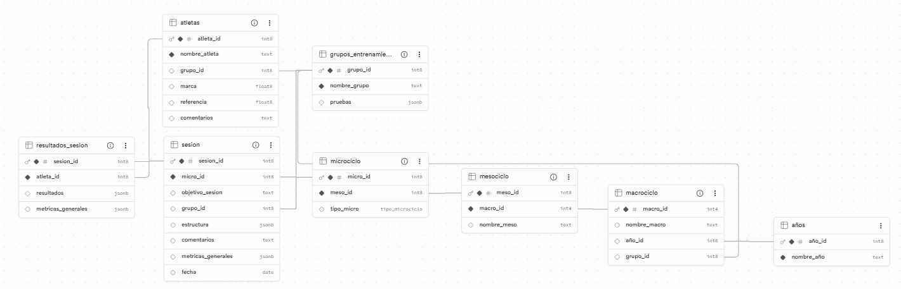

# Diario_Entrenamientos

## 🎯 Descripción y objetivos del proyecto

Este proyecto tiene por objetivo general **facilitar la planificación** del entrenamiento deportivo a través de varios sub-objetivos:

- Hacer una **interfaz interactiva que reduzca el tiempo** empleado en planificar (en Ciencias del Deporte en la actualidad se trabaja sobre todo con Excel).
-  Permitir que los atletas puedan **ver el entrenamiento de cada día e introducir sus resultados**. De esta forma, se puede llevar un **control del entrenamiento** de cada deportista.
-  A través de gráficos, complementar la **comprensión del entrenamiento** para los corredores. Las gráficas son también interesantes para el entrenador, ya que le permite **comprobar de forma rápida si las cargas están bien ajustadas** para los objetivos de cada semana.

## ⚒️ Estructura del dashboard y funcionalidades implementadas

### Estructura

El dashboard tiene cuatro pestañas:

1. **Planificación**: En esta pestaña el entrenador define la planificación. En los filtros puede elegir a qué temporada (año natural) y a qué grupo (CNP, Policía Municipal, Guardia Civil o Militar) pertenece dicha planificación.

Si en la base de datos (BBDD) ya existe una planificación para esa temporada y ese grupo, se puede cargar. En caso contrario, se puede crear desde 0.

Con el botón "Sincronizar" los datos pueden añadirse (o actualizarse si ya existían) en la BBDD.

Dentro de cada macrociclo (trimestre), se pueden añadir o eliminar microciclos (semanas) de cada uno de los mesociclos (meses). Dentro de cada microciclo se puede escribir el objetivo de cada sesión.

En el botón del engranaje puede añadirse la estructura específica de cada sesión. Al darle a "Guardar" los datos se guardan en memoria. Al pulsar en el botón "Sincronizar" los datos de las sesiones también se guardan en su correspondiente tabla de la BBDD.

2. **Resultados atletas**: En esta pestaña los atletas pueden escribir las marcas que han hecho en cada una de las series del entrenamiento (pueden elegir su nombre y la sesión que quieren añadir en los filtros), la recuperación que han tenido y su percepción del esfuerzo (RPE). Al pulsar en el botón "Guardar Resultados" los datos se guardan en su correspondiente tabla de la BBDD (se añaden o se actualizan). Al igual que en la pestaña anterior, si ya había datos para un atleta en una sesión, se cargan automáticamente en la pestaña.

3. **Perfiles atletas**: En esta hoja aparece el perfil del atleta que se seleccione en los filtros. Aparece su mejor marca en la prueba objetivo de su oposición (1000 para CNP, 800 para Policía Municipal y 2000 para Guardia Civil y Militar) y su ritmo de referencia (se explica en el siguiente apartado). Los datos de esta pestaña se pueden cargar de la BBDD si ya existen y se pueden añadir o actualizar pulsando el botón verde.

4. **Análisis**: En esta pestaña se presentan las visuaizaciones del año, del macrociclo, del mesociclo, del microciclo y dos de la sesión. Los filtros permiten localizar una temporada, grupo, trimestre, sesión o atleta en específico.

Para las visualizaciones se han calculado métricas como el volumen, la intensidad, la densidad y la carga del entrenamiento (se explican en el siguiente apartado). Para las generales se han utilizado los datos del diseño de la sesión (primera pestaña). Para las visualizaciones de los atletas se han utilizado los datos de su perfil y de sus resultados de entrenamiento.

### Funcionalidades

1. **Diseño de la Interfaz de Usuario (UI) y Arquitectura Visual**

La estructura externa de la aplicación se ha diseñado mediante el paquete *shinydashboard*, organizando el espacio de trabajo a través de un menú lateral (*sidebarMenu*) que distribuye la navegación de forma intuitiva.

La distribución de los elementos visuales se basa en el sistema de rejilla (*grid system*) de Bootstrap, empleando contenedores de filas (*fluidRow*) y columnas (*column*) para garantizar un diseño ordenado. Dentro de estos espacios se han integrado múltiples componentes de entrada (*inputs*) adaptados al contexto, como selectores de fechas, campos numéricos y cuadros de texto.

Mediante *uiOutput* y *renderUI* la interfaz se reconfigura en tiempo real dependiendo de las acciones del usuario; por ejemplo, las cajas para introducir las marcas de los atletas aparecen y se ajustan de manera automática según el número exacto de repeticiones que el entrenador haya planificado para esa sesión.

2. **Gestión del Estado y Lógica Reactiva**

Delegación de datos reactivos (*reactive*): Se han implementado expresiones reactivas encargadas de gestionar las conexiones y consultas a la base de datos externa de Supabase.

Variables de estado (*reactiveVal*): Se han incorporado objetos reactivos de valor único para almacenar de forma segura el estado de variables en memoria, como el borrador de la planificación actual.

Observadores de eventos (*observeEvent*): Se ha estructurado una serie de oyentes que actúan como ejecutores de acciones específicas ante interacciones concretas del usuario, controlando de forma estricta los momentos en los que se guardan los resultados, se actualizan los perfiles o se sincronizan los trimestres.

3. **Interacción con el Usuario y Robustez del Sistema**

Validación de ejecución (*req*): Se ha protegido el flujo reactivo mediante funciones de requerimiento. Esto asegura que el código se detenga silenciosamente si un dato necesario aún no está disponible (por ejemplo, al dejar casillas vacías durante la edición), impidiendo la aparición de errores en pantalla.

Cuadros de diálogo emergentes (*showModal* y *modalDialog*): Se han diseñado ventanas flotantes para aislar la configuración de tareas complejas, como el diseño pormenorizado de los bloques de series, manteniendo la pantalla principal libre de saturación visual.

Avisos temporales (*showNotification*): El sistema mantiene una comunicación constante con el usuario emitiendo pequeñas notificaciones contextuales de éxito o advertencia según el resultado de las operaciones en segundo plano.

4. **Componentes de Salida e Informes Visuales**

Tablas interactivas (*DT*): Se ha integrado el paquete DT para renderizar la matriz temporal de los trimestres en la pestaña del planificador, permitiendo una visualización tabular organizada por semanas.

Gráficos estáticos con *ggplot2*.

### BBDD

## 📚 Descripción de los datos utilizados y su orgien

Los datos utilizados son de elaboración propia de la planificación deportiva para las pruebas de acceso al Cuerpo Nacional de Policía, Policía Municipal, Guardia Civil y Militar.

Cada planificación anual se divide en cuatro trimestres o **macrociclos** que tienen la misma estructura: 
- Un **mesociclo básico** (es el mesociclo que trabaja los contenidos más alejados de la prueba).
- Un **mesociclo específico** (las cargas se acercan a la situación real de la prueba).
- Un **mesociclo competitivo** (la mayoría de cargas son muy similares a las características de la prueba y se hace una puesta apunto).
Los mesociclos suelen durar entre 3 y 5 semanas.

Cada mesociclo se compone de microcilos que duran una semana. En función de los objetivos del **microciclo** se establecen los siguientes tipos:
- **Recuperación**: Pensado para hacer recuperación activa.
- **Ajuste**: Es un microciclo con cargas medias entre el microcilo de recuperación y el de carga.
- **Carga**: En este microciclo se hacen entrenamientos enfocados en potenciar capacidades concretas.
- **Impacto**: Este microciclo se usa cuando se quieren introducir nuevas capacidades en la planificación.
- **Aproximación**: En este microciclo las cargas buscan especificidad sin agotar.
- **Competición**: Es la semana correspondiente a la competición.

Cada microciclo se compone de dos **sesiones** cuyos objetivos dependen de la capacidad física que se quiera trabajar. Pueden ser:
- Potencia Aláctica (PALA)
- Capacidad Aláctica (CALA)
- Potencia Láctica (PLA)
- Capacidad (CLA)
- Potencia Aeróbica (PAE)
- Capacidad Aeróbica (CAE)
- Aeróbico Intensidad (AEI)
- Aeróbico Medio (AEM)
- Aeróbico Ligero (AEL)

Cada sesión se compone de un calentamiento, una parte de velocidad y una parte principal de series más largas.
Las cargas de entrenamiento se miden con el **volumen** de cada serie, el volumen total de la sesión, la **intensidad** de las series (en esta planificación se mide relativamente con el ritmo de referencia*) y la **densidad** del entrenamiento (el ratio entre tiempo de trabajo y tiempo de descanso). De la multiplicación del volumen con la intensidad se obtiene la **carga**.

*El ritmo de referencia se calcula con respecto a la prueba objetivo. Por ejemplo, para el CNP se debe preparar un 1000. Un deportista que tenga una marca personal en 1000 de 3'00" tiene una media de 19" por cada 100m. Ese es su ritmo de referencia. Si en una serie de 400 el ritmo fuera +2" del 1000 (2 segundos más lento que el ritmo de referencia para el 1000), ese atleta tendría que hacer un 400 a 21" cada 100, lo que daría un total de 1'24". En cuanto a la densidad, si después de esta serie el descanso fuera de 1'30", el ratio trabajo-descanso seria aproximadamente de 1:1.

## 🌐 Enlace a ShinyApps

https://albamh01.shinyapps.io/dashboard_entrenadores_y_atletas/

## 📊 Explicación de los fundamentos de la visualización de datos aplicados en el dashboard

Las visualizaciones deben ser realistas, dar la información justa adaptada al receptor y sin sobrecargar visualmente las gráficas se ha atendido a los siguientes principios:

- Se han utilizado gráficos de barras porque son muy informativas y son las más sencillas de entender para el ojo humano. Permiten diferenciar claramente la presencia y magnitud de los cambios en las cargas de entrenamiento.

- Se han utilizado los colores para separar elementos. Se ha utilizado siempre el mismo color para representar las cargas de la planificación general y un color para las cargas de cada atleta, en concordancia con su oposición (diferentes tonos de azul para CNP y Policía Municipal y diferentes tonos de verde para Guardia Civil y Militar).

- Para las visualizaciones en las que se muestran diferentes medidas del entrenamiento se han hecho pequeñas gráficas, cada una con un eje Y adaptado a los mínimos y los máximos de cada métrica.

- En las gráficas de las sesiones, donde se muestra la carga de entrenamiento y la densidad, se han separado en distintos ejes cada una de las métricas para que cada una tuviera su propio eje. De esta forma, se sigue aportando la misma información, de manera más realista y sin sobrecargar visualmente la interfaz. Cabe destacar que estas gráficas eran específicas o de la planificación general o del atleta. Para que los ejes no estuvieran truncados, se ha calculado el mínimo y el máximo de cada métrica para la planificación general y para la individual. La que mayores valores tuviera es la que se ha establecido como eje para las dos gráficas.

- En las gráficas de las sesiones también se han utilizado colores para diferenciar las cargas de la parte de velocidad y de la principal, pero sin repetir los colores que se pueden asociar a las gráficas anteriores.

## 🧠 Conclusiones y posibles mejoras futuras

Este proyecto permite agilizar el proceso de planificación deportiva y llevar un control del entrenamiento en el que se reduce consierablemente la carga de trabajo del entrenador, sin por ello aumentar notablemente la del deportista. Además, permite que este tenga y comprenda su propio diario de entrenamiento, una muy buena práctica en el deporte de rendimiento, donde no solo se busca la mejora física sino también la educación en el deporte. Unas visualizaciones sencillas, informativas y realistas pueden potenciar mucho esta tarea.

Como proyecto de futuro se proponen las siguientes mejoras:

- Mejorar la interfaz para hacerla aún más interactiva (cambiar los botones de +/- en los microciclos por tarjetas que se puedan desplazar).

- Dotar al dashboard de un diseño más moderno.

- Buscar nuevas visualizaciones como la evolución de todas las sesiones a lo largo de los años o estadísticas de entrenamiento (% de entrenamientos de cada uno de los objetivos).

- Obtener las zonas de entrenamiento con sus ritmos asociados para cada atleta.

- Permitir una entrada de entrenador a cualquiera de las pestañas y una entrada a los deportisas a las pestañas de "Resultados", "Perfil" y "Análisis".

- Poder descargar un fichero o elaborar en la propia web un diario que pueda descargarse al completar un mes, un trimestre o un año.

- Ampliarlo a otros deportes de condición física como natación, ciclismo o remo.
